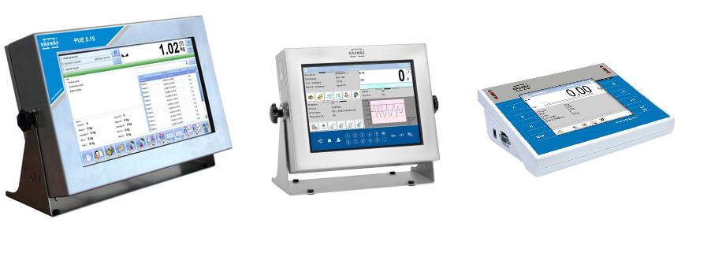
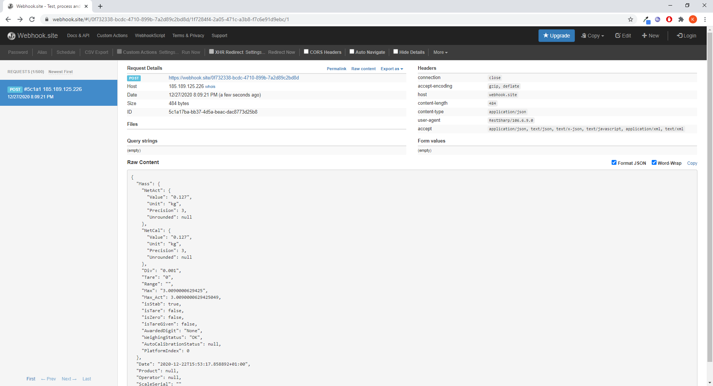

# WeighingWebHook
Simple example of getting weighing records via webhooks


  
  Radwag terminals, balances and scales enable export of weighing records not only to a USB flash drive or via external software (E2R, RST Report, etc.) but also using the convenient RestApi.



    
  In Menu/Peripherals/Computer/REST server address enter the address of your own REST server supporting the POST method that will await for the weighing records.
 The weighing records will be sent in JSON format and will contain basic data on mass, date, selected product and operator who carried out the measurement.
 ``` 
  {
  "Mass": {
    "NetAct": {
      "Value": "0.127",
      "Unit": "kg",
      "Precision": 3
    },
    "NetCal": {
      "Value": "0.127",
      "Unit": "kg",
      "Precision": 3
    },
    "Div": "0.001",
    "Tare": "0",
    "Range": "",
    "Max": "3.0090000629425",
    "Max_Act": 3.0090000629425049,
    "isStab": true,
    "isTare": false,
    "isZero": false,
    "isTareGiven": false,
    "AwardedDigit": "None",
    "WeighingStatus": "OK",
    "AutoCalibrationStatus": null,
    "PlatformIndex": 0
  },
  "Date": "2020-12-22 15:53:17.858",
  "Product": "PRODUCT 1",
  "Operator": "Admin",
  "ScaleSerial": "123456789"
}
```
When creating your own API that will receive the weighings, take into account the above format. Obtained data can be stored in your own database or used according to your needs. The data will be sent within several dozen seconds after carrying out the measurement. If the terminal is currently not connected to the server, it will try to send the data again until successful.

  As an example the https://webhook.site/ wesite was used. It enables to test the API free of charge. Below is a screen presenting the weighing record sent by the HY10 terminal. 

